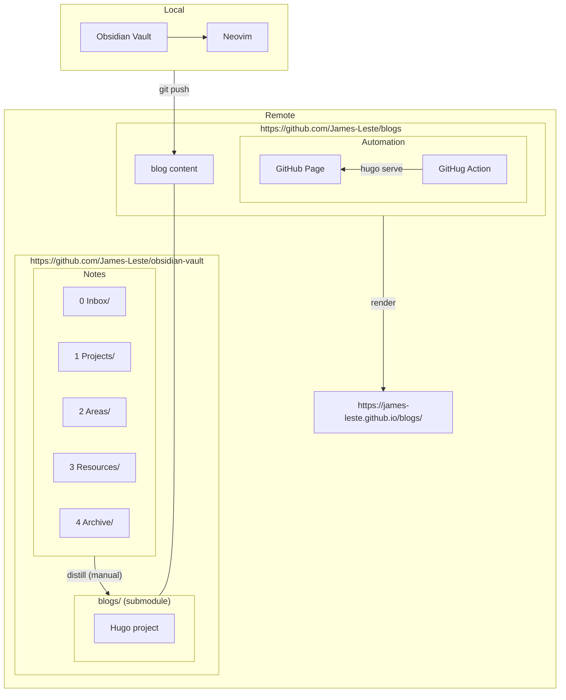

+++
date = '2026-04-06T00:10:19+03:00'
draft = false
title = 'How This Blog Site is Automated?'
+++

## Overview

Originally, I have been syncing my personal notes to a private GitHub remote
repository. Lately, I felt like publishing/distilling some of them as public
blog posts.

**I wish the architecture of the blog site is**
- git-based
- markdown-based
- automatically deployed
- part of the original notes repository

**Corresponding technology selections**
- Git for version control
- [Hugo](https://gohugo.io/) for **markdown to static pages**
- GitHub Page + GitHub Actions for CI/CD
- Git submodules for repo linking

---

## Problems and Solutions
### 1. Note Distilled to Blogs with `git submodule`

 Without breaking the private nature of the repository while making
part of the repository public, I utilized famous `git submodule`.

* **The Parent Vault (`obsidian-vault`):** A strictly private Git repository
containing all personal notes.
* **The Submodule (`blogs/`):** A separate, public repository nested inside the
vault.

By isolating the blog into its own Git repository, I can grant deployment
servers (like GitHub Actions) access *only* to the public posts, ensuring my
private vault remains completely secure.

### 2. The Publishing Automation Pipeline (Hugo + GitHub Pages)

With the submodule isolating the public content, I can attach a CI/CD pipeline
directly to the `blogs` repository. When a new note is pushed from the local
`blogs/` directory, GitHub Actions automatically builds the Hugo site and
deploys it to GitHub Pages.

---

## Architecture

*Fig 1. The architecture of the the automation of this blog site*

## Reference links

**Hugo**
- [Hugo - Quick Start](https://gohugo.io/getting-started/quick-start/)
- [Hugo - Host on GitHub Pages](https://gohugo.io/host-and-deploy/host-on-github-pages/)
- [What to .gitignore in a Hugo project](https://discourse.gohugo.io/t/what-do-i-commit-to-git/52247/2)
- [Getting Mermaid Diagrams Working in Hugo (mikesahari)](https://blog.mikesahari.com/posts/hugo-mermaid-diagrams/)
- [PaperMod (a Hugo template)](https://github.com/adityatelange/hugo-PaperMod)

**Git submodule**
- [Git Submodules - Basic Explanation](https://gist.github.com/gitaarik/8735255)

