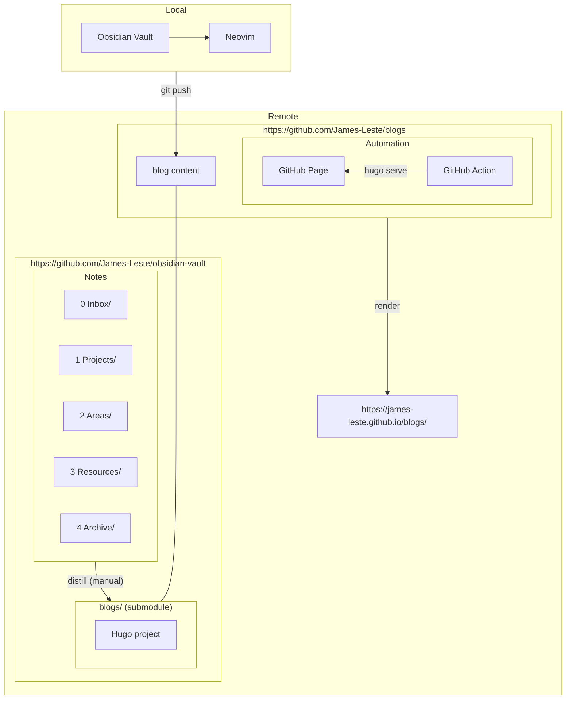

+++
date = '2026-04-06T00:10:19+03:00'
draft = false
title = 'How This Blog Site is Automated?'
+++

## Overview

I have always been syncing my personal notes to a private GitHub remote
repository. Lately, I felt like publishing/distilling some of them as public
blog posts.

**I wish the architecture of the blog site to be**
- git-based
- markdown-based
- automatically deployed
- part of the original notes repository

**Corresponding technology selections are**
- Git for version control
- [Hugo](https://gohugo.io/) for **markdown to static pages**
- GitHub Page + GitHub Actions for CI/CD
- Git submodules for repo linking

---

## Problems and Solutions
### 1. Notes Distilled to Blogs with `Git submodule`

Without breaking the private nature of the repository while making part of the
repository public, I utilized `git submodule`.

* **[obsidian-vault](https://github.com/James-Leste/blogs):** A strictly private
GitHub repository containing all personal notes (PARA system).
* **[blogs](https://github.com/James-Leste/blogs):** A separate, public GitHub
repository nested inside the vault.

Nesting **blogs** inside **notes** as a submodule makes it possible to edit both
parts locally without changing the project directory. However, it is not an
essential requirement since no hard dependencies exist between notes and blogs.

### 2. The Publishing Automation Pipeline (Hugo + GitHub Pages)

Blogs are written as individual markdown files. To host structured text content
on a server, they need to be converted to HTML files (possibly bundled with
stylesheets). [Hugo](https://gohugo.io/) is a great tool for markdown-to-html
conversion and blog hosting. Thus, Hugo is chosen as the static site generator
for this blog site.

With the submodule isolating the public content, a CI/CD pipeline can be
attached directly to the **blogs** repository. When a new note is pushed from
the local `blogs/` directory, GitHub Actions automatically executes Hugo build
process and deploys it to [GitHub
Pages](https://docs.github.com/en/pages/getting-started-with-github-pages/what-is-github-pages#types-of-github-pages-sites).

### 3. Customize Font and Favicon (PaperMod Theme)

#### Change Font
Get import URL from [Google Font](https://fonts.google.com/)

```css
@import url('https://fonts.googleapis.com/css2?family=Lora:ital,wght@0,400..700;1,400..700&display=swap');
```

Place custom css file to `static/fonts/<fontname>.css`
([Lora](https://fonts.google.com/specimen/Lora) as an example)

```css
@import url('https://fonts.googleapis.com/css2?family=Lora:ital,wght@0,400..700;1,400..700&display=swap');
body, html, p, li {
    font-family: 'lora', serif !important;
}

h1, h2, h3, h4, h5, h6 {
    font-family: 'lora', serif !important;
}
```

Extend it with `layouts/partials/extend_head.html`

```html
<link rel="stylesheet" href="{{ "fonts/lora.css" | absURL }}">
```

#### Change Favicons
place favicons under `static/icons/`
```bash
obsidian/blogs [main] > ls static/icons
android-chrome-192x192.png      apple-touch-icon.png            favicon-32x32.png               site.webmanifest
android-chrome-512x512.png      favicon-16x16.png               favicon.ico
```

adjust `config.yaml` according to
[config.yaml](https://github.com/adityatelange/hugo-PaperMod/blob/exampleSite/config.yml)

```yaml
assets:
  favicon: "icons/favicon.ico"
  favicon16x16: "icons/favicon-16x16.png"
  favicon32x32: "icons/favicon-32x32.png"
  webmanifest: "icons/site.webmanifest"
  apple_touch_icon: "icons/apple-touch-icon.png"
```
---

## Architecture


*Fig 1. The architecture of the automation of this blog site*

## Reference links

**Hugo**
- [Hugo - Quick Start](https://gohugo.io/getting-started/quick-start/)
- [Hugo - Host on GitHub
Pages](https://gohugo.io/host-and-deploy/host-on-github-pages/)
- [What to .gitignore in a Hugo
project](https://discourse.gohugo.io/t/what-do-i-commit-to-git/52247/2)
- [Getting Mermaid Diagrams Working in Hugo
(mikesahari)](https://blog.mikesahari.com/posts/hugo-mermaid-diagrams/)
- [PaperMod (a Hugo template)](https://github.com/adityatelange/hugo-PaperMod)
- [Is it possible to use custom fonts on
PaperMod?](https://github.com/adityatelange/hugo-PaperMod/discussions/383)
- [How do I set the favicon for my
webpage](https://github.com/adityatelange/hugo-PaperMod/discussions/953)

**Git submodule**
- [Git Submodules - Basic Explanation](https://gist.github.com/gitaarik/8735255)

**GitHub**
- [GitHug Pages - Types of GitHub Pages
sites](https://docs.github.com/en/pages/getting-started-with-github-pages/what-is-github-pages#types-of-github-pages-sites)
